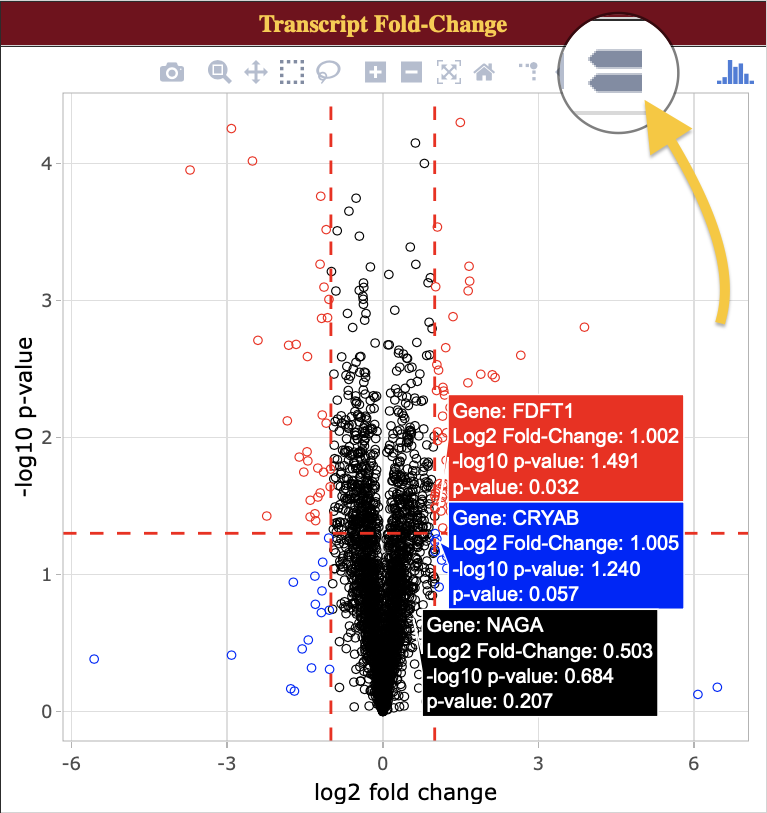

# <a href="https://pubs.acs.org/doi/abs/10.1021/acs.jproteome.8b00727" target="_blank">QuanTP: A Software Resource for Quantitative Proteo-Transcriptomic Comparative Data Analysis and Informatics</a>

Praveen Kumar †‡▽, Priyabrata Panigrahi §▽, James Johnson ∥∥, Wanda J. Weber ⊥,
Subina Mehta ‡, Ray Sajulga ‡, Caleb Easterly ‡, Brian A. Crooker ⊥, Mohammad
Heydarian #, Krishanpal Anamika \*§, Timothy J. Griffin ‡, and Pratik D. Jagtap\*‡

   † Bioinformatics and Computational Biology Program, University of Minnesota-
   Rochester, Rochester, Minnesota 55904, United States

   ‡ Department of Biochemistry, Molecular Biology, and Biophysics, University of
   Minnesota, Minneapolis, Minnesota 55455, United States

   § LABS, Persistent Systems, Aryabhata-Pingala, Erandwane, Pune 411004, India

   ∥∥ Minnesota Supercomputing Institute, University of Minnesota, Minneapolis, Minnesota
   55455, United States

   ⊥ Department of Animal Science, University of Minnesota, St. Paul, Minnesota 55108,
   United States

   \# Department of Biology, Johns Hopkins University, Baltimore, Maryland 21218, United
   States

*▽ these authors contributed equally to this work*

***Corresponding author(s):**  
Pratik Jagtap and Krishanpal Anamika  
Email: [pjagtap@umn.edu](mailto:pjagtap@umn.edu) and [anamika_krishanpal@persistent.com](mailto:anamika_krishanpal@persistent.com)  
Phone: +1 612 624 0381 and +91 (20) 6703 3000

[Original "Supporting Information" Document](https://drive.google.com/file/d/1A6HSRjCMrHUVv5Zk98dMXEV0O_5wjUai/view)

---

### Newest Update: Interactive plots for QuanTP (versions ≥ 1.1.0)

2.21.19 - All plots can now be viewed via <a href="https://plot.ly/javascript/" target="_blank">Plotly</a> for interactivity! Instructions for enabling this are [here](#s1a-instructions-for-enabling-interactivity-).

Features:
- Zooming and panning
- Export plots in png format
- Mousing over points to view more details and compare them with one another


---

## S1: Instructions for accessing the QuanTP tool on Jetstream

1. Go to <a href="http://z.umn.edu/proteogenomicsgateway" target="_blank">z.umn.edu/proteogenomicsgateway</a>. This is a public Galaxy gateway hosted on
    the Jetstream (<a href="https://jetstream-cloud.org/" target="_blank">https://jetstream-cloud.org/</a>), a cloud-based resource for scientific
    computing and research.
2. The Galaxy Jetstream instance requires that all users input an email address to access
    tools and workflows. To register, perform the following steps:  
   - Click on the “Login or Register” tab and click on “Register”. Enter an email address,
password and public name of choosing. [ NOTE: Users choosing to remain
anonymous can enter an email in the form of "guest@galaxyp.org", along with a
password and public name of your choosing. Also note that this instance is solely
for training purposes, and not for long-term use or testing with large datasets.]  
   - Once registered, click on the "User" tab and click on “Login” with your user
credentials.
3. The Galaxy interface is divided into three panels: a _Tool pane_ on the left side of the
    interface, a _Main viewing pane_ in the center and a _History pane_ to the right. The _Tool pane_
    consists of organized list of software tools available to users in a particular Galaxy
    instance. The _Main view_ displays the information regarding the tool, input/output from
    the tool, workflow editing space, etc. The _History pane_ contains an ordered list of datasets
    that were uploaded and generated as outputs from tools used for analysis. The active
    history is shown in the _History Pane_ of the user interface.
    
4. The first step for the analysis is to import the required input datafiles. For running any
    workflow, appropriate inputs that the tools requires is critical. To access the inputs for
    this demonstration, we have provided two input data libraries (bovine dataset and mouse
    dataset). Let’s begin the initial testing with the bovine dataset, click on “Shared Data”→
    “Data libraries”→ “QuanTP Inputs”→ “QuanTP_cow_input **”,** select all files in the folder**.**
    Then, click on  to import all the input files. The input file consists of protein,
    transcript abundance data and an experimental design file, all in tabular format.
5. Once the files have been imported, these will show up as items in our active history.
    
6. The goal of the tool is to use the protein and transcript abundance file to create an HTML
    output that acts as a compilation of QuanTP's proteo-transcriptomic quantification and correlation.
    To access the tool, click on the search panel on the Tool pane. Search for “QuanTP”. Or you could 
    also find the tool in the Tool Pane under “Proteogenomics”.
7. The QuanTP tool’s interface will now show up on your _Main viewing pane_. To run this tool
    on the imported input files in the active History, the user has to make sure to select the
    appropriate inputs.
8. Select the inputs as shown below and then click on **Execute**.
    

9. Once the tool is executed, the output will show up on the active history pane. It will be
    displayed in yellow color while running and green once complete. The output of the tool is
    in the HTML format. To view this output, click on the eye icon . To download the
    output for offline viewing and sharing, click on the disk icon . This will
    download the complete HTML output and its supporting files in an archived zip file.

---

### S1A: Instructions for enabling interactivity

1. After running QuanTP (v1.1.0 or above) and obtaining an HTML file, click on that HTML file to expand the options, then select the visualization icon:  
    

2. In the resulting pane, click "Interactive Viewer" and allow the viewer to render for a few seconds.
    

#### Things to try:

- Zoom in/out and pan around.
- Hover over data points to view more information about selected data.
- Activate "compare data on hover" to compare similar points:
    
- On the heatmap, click and drag a box across a subsection to zoom in. To reset the view, double click the heatmap.
    
    
---

## S2: Instructions for accessing and running the Mouse data
(Heydarian M., Luperchio T.R., Cutler J., Mitchell C.J., Kim M.S., Pandey A., Sollner-Webb B., Reddy K.
Prediction of Gene Activity in Early B Cell Development Based on an Integrative Multi-Omics Analysis.
_Journal of Proteomics and Bioinformatics_. (2014) 7:050-063; DOI: 10.4172/jpb.1000302)

1. To access the inputs for the mouse data click on “Shared Data”→ “Data libraries”→
    “QuanTP Inputs” → “QuanTP_mouse_input **”,** select all files in the folder**.** Then, click on
       to import all the input files. The input file consists of protein, transcript
    expression data and an experimental design file, all in tabular format. _For demo_
    _purposes all these datasets have been trimmed to contain only a small amount of data._

2. Once the mouse files have been imported, they will show up in the active History. The
    history consists of two input files, a Protein_log_data.txt (protein expression data) and
    Transcript_log_data.txt (transcript expression data).
3. To access the QuanTP tool, click on the search panel on the Tool pane (left pane). Search
    for “QuanTP” tool.
4. The QuanTP tool’s interface will now show up on your “Main viewing pane”. To run this
    tool on the imported input files in the active history, the user has to make sure to select
    the appropriate inputs.
5. Select the below mentioned inputs and then click on “ **Execute** ”

    - Input Protein Expression File : “Protein_log_data.txt”
    - Input RNA Expression File : “Transcript_log_data.txt”
    - Select data type: Log fold-change values (or single condition abundance without
    replicates in single column) data
    - Influential Observation cutoff : “4”
    - K-mean clustering: Number of clusters : “4” (default)
    - Hierarchical clustering: Number of clusters (from Heatmap) : “5” (default)

6. Once the tool is executed, the output will show up on the active history pane. It will be
    displayed in yellow color while running and green once completed. The output of the tool
    is in the HTML format. To view this output, click on the eye icon. 

## S3: Instructions for accessing zebrafish embryo data
(Alli Shaik, A.; Wee, S.; Li, R. H. X.; Li, Z.; Carney, T. J.; Mathavan, S.; Gunaratne, J. Functional Mapping of
the Zebrafish Early Embryo Proteome and Transcriptome. _J. Proteome Res._ **2014** , _13_ (12), 5536–5550.)

1. To access the zebrafish embryo data, go to <a href="http://z.umn.edu/proteogenomicsgateway" target="_blank">z.umn.edu/proteogenomicsgateway</a>.
2. Click on “Shared Data”→ “History”→ “QuanTP_zebrafish_embryo_data”. This will show
    the history with three items in it. Then, click on “Import History” to import the history.
3. Dataset 1 labeled as “ protein_abundance_log10” is the tabular file containing the
    protein abundance whereas dataset 2 “transcript_abundance_log10” contains the
    transcript abundance. Dataset 3 named as “QuanTP Output on data 1 and data 2” is the
    HTML output generated by the QuanTP.
4. To view this output, click on the eye icon. 

---

## S4: Accessing the QuanTP Docker Image
_Up-to-date instructions and a Dockerfile can be accessed at <a href="http://z.umn.edu/quantpdocker" target="_blank">z.umn.edu/quantpdocker</a>._

1. Download and install Docker (<a href="https://www.docker.com/get-started" target="_blank">https://www.docker.com/get-started</a>). Once installed,
    open it and allow it to initialize.
       a. Open your terminal/command prompt to interact with Docker:
          i. Mac: Press "⌘ + space bar", type "terminal"
ii. PC: Press "Win-R", type "cmd" and press "Enter"
iii. Linux: Ctrl + Alt + T
2. Install the container
    a. Enter this command into your terminal:
       ```docker run -d - p 8080:80 galaxyp/quantp```
    b. The QuanTP image will be downloaded from the Docker Hub and will initialize
       itself into a container. This will take a few minutes.
    c. Once the container is initialized, the terminal will output your container's ID and
       take some time to initialize.
3. Access your initialized QuanTP Docker container at <a href="http://localhost:8080" target="_blank">http://localhost:8080</a>.
    a. Optional: Register an account by following step 2 in the first section ( **Instructions**
       **for accessing the QuanTP tool on Jetstream)**
          i. _Docker containers are inherently temporary, so only register if you plan_
             _on leaving the demonstration open for an extended period of time._
    b. To run through bovine data, follow steps 4 through 9 in the first section
       ( **Instructions for accessing the QuanTP tool on Jetstream)**
    c. To run through mouse data, go through the second section ( **Supplementary for**
       **accessing and running the Mouse data)**
    _d. Note: When referencing the JetStream instructions, filenames on the Docker_
       _image may differ._
4. Once finished with the Docker container, simply exit out of the Docker program to
    terminate your session.
       a. If you would like to keep Docker program running on your machine, you can
          terminate your container as follows:
             i. If you don't know your container ID, list out the container IDs with this
                command: ```docker ps```
ii. Using this ID, issue this command: ```docker kill [ID]```

---

## S5: Accessing QuanTP on the usegalaxy.eu
1. Go to <a href="https://usegalaxy.eu" target="_blank">https://usegalaxy.eu</a>. This is a European Galaxy platform.
2. The Galaxy instance requires that all users input an email address to access tools and
    workflows. To register, perform the following steps:
    - Click on the “Login or Register” tab and click on “Register”. Enter an email address,
          password and public name of choosing. [ **NOTE:** Users choosing to remain
          anonymous can enter an email in the form of "guest@galaxyp.org", along with a
          password and public name of your choosing. Also note that this instance is solely
          for training purposes, and not for long-term use or testing with large datasets.]
    - Once registered, click on the "User" tab and click on “Login” with your user
    credentials.
3. Here we provide users with an integrated Galaxy tool’s interactive tour.
4. Firstly, search for the QuanTP tool in the search bar located on the top left of the Tool Pane.
    Select the QuanTP tool. Now the interface of this tool is displayed on the center pane.
5. Go to options on the right end of the center Pane and click on it. Select the “Generate Tour”
    option.  
    
6. Once you select the “Generate Tour” option. Galaxy will import the required test Data to
    run the tour. The interactive tour will guide you through the steps required to run the tool.  
    
7. Select the appropriate inputs as guided by the tour and once completed, select “Execute”.
Once the tool is executed, the output will show up on the active history pane. The output of the
tool is in the HTML format. To view this output, click on the eye icon. 

---

## Supplementary Figure
**Figure S1.** Example input data file format


**Figure S1.** The three tables here describe the format of the input files to QuanTP tool, required
in the “abundance mode”. The first two files should contain gene symbols and abundance
values for protein or transcript. The third file, experiment design, defines the sample (column)
names in the first two input files along with defining “case” and “control” groups in the first two
lines.
